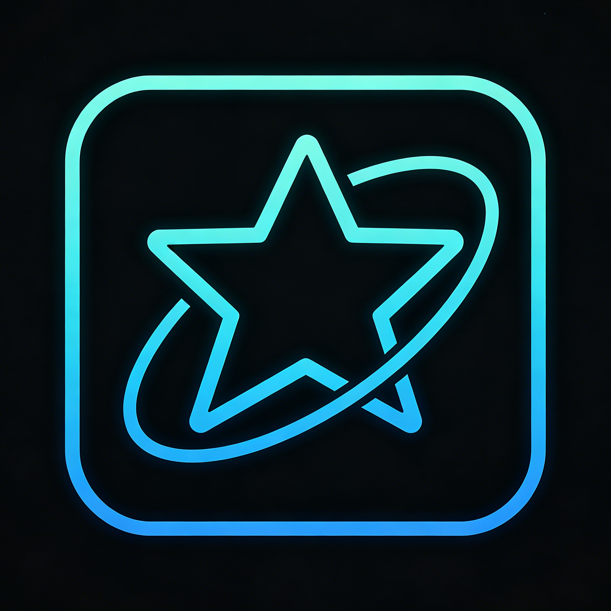

# StarMenory

<p align="center">
  
</p>

<p align="center">
  
  
  
</p>

<p align="center"><strong>StarMenory = Star + Memory — Persistent Stellar Memory</strong></p>

<p align="center">OpenCode Long-term Memory Plugin & Skill System. Let AI remember your preferences, rules, and project context.</p>

<small><a href="./README_CN.md">中文</a></small>

---

<p align="center">
  
  <br/><em>Auto record fragment memory</em>
  <br/><br/>
  
  <br/><em>Manual query memory</em>
</p>

---

## Installation

Copy and send this to AI for automatic installation:

```
Install StarMenory v1.3.0: https://github.com/owofile/opencode-starmemory-plugins/tree/main/v1.3.0
```

---

## Directory Structure

```
opencode-starmemory-plugins/
├── v1.3.0/                      # Recommended version
│   ├── INSTALL.md
│   ├── plugins/opencode-memory/
│   ├── skills/
│   │   ├── memory-manager/
│   │   └── memory-fragment/
│   ├── associations_map.json
│   └── opencode.json
├── v1.2.0/
├── v1.1.0/
├── v1.0.0/
├── docs/
│   ├── StarMenoryLOGO.png
│   ├── 自动记录相关记忆.gif
│   └── 手动查询记忆演示.gif
└── README.md
```

---

## License

MIT